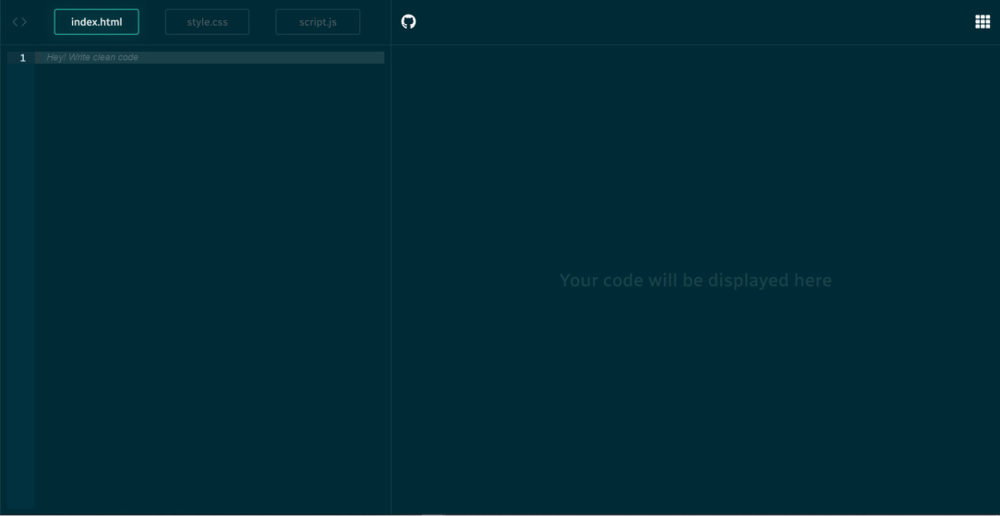
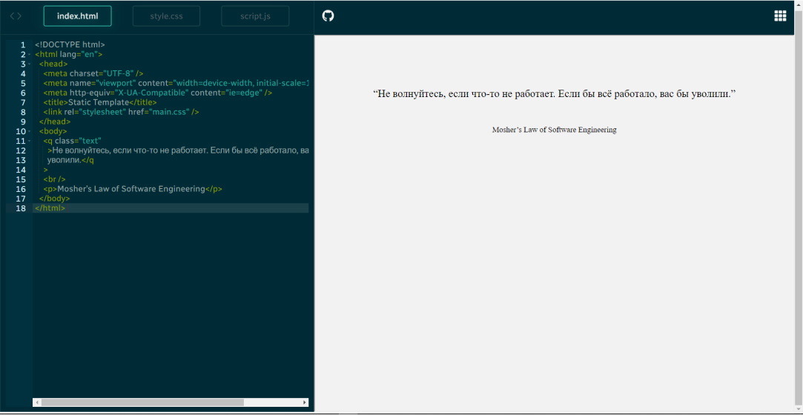
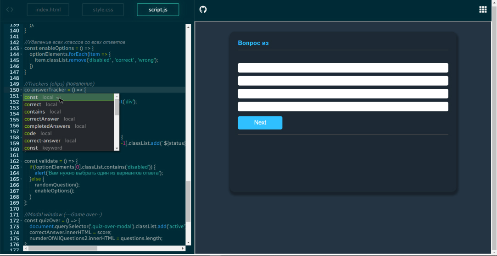
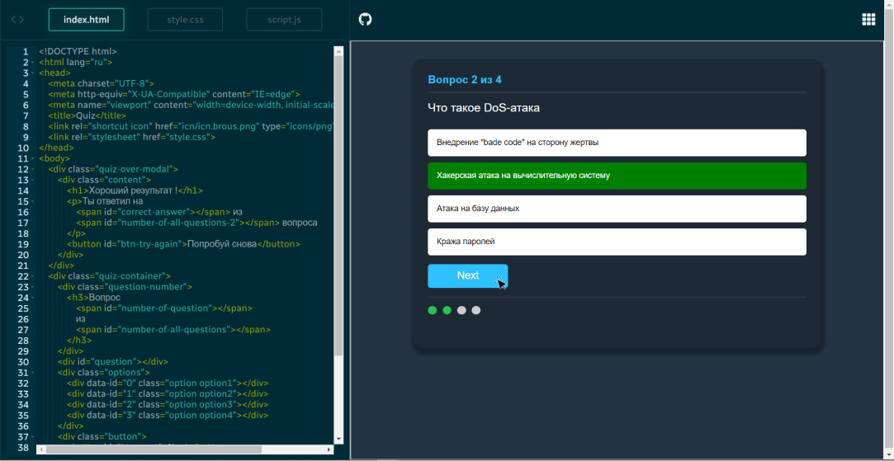
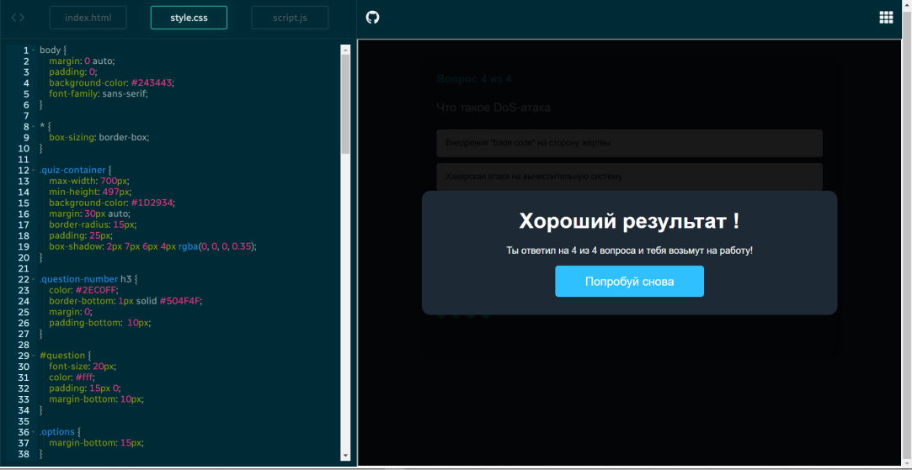

# Code Cloud | online-editor 
#### Code Cloud - это платформа для редактирования кода на HTML, CSS и JavaScript с просмотром готового результата в браузере.
___
## Технологии проекта:


## Дполнительные [npm](https://www.npmjs.com/) пкеты:
- Иконки взяты с [React Icons](https://react-icons.github.io/react-icons/)
```javascript
    $ npm i react-icons
```
- Фундамент приложения самого редактора [React Ace](https://www.npmjs.com/package/react-ace)
```javascript
    $ npm i react-ace
```

## Подробно поработал с [хуками:](https://ru.reactjs.org/docs/hooks-intro.html)
`useState()` ------- `useContext()` ------- `useMemo()`

**Задействовал функциональный подход**
___
## Общий вид UI и описание логики:
#### По умолчанию, библиотека предоставляет готовый компонент, который можно самостоятельно модернизировать и сделать под свои нужды.
+ Моя настройка редактора
```jsx
    return (
        <AceEditor
            placeholder='Hey! Write clean code'
            mode='javascript'
            theme='solarized_dark'
            name='editor_js'
            value={js}
            onChange={value => setJs(value)}
            fontSize={16}
            height={'100%'}
            width={'100%'}
            showPrintMargin={false}
            showGutter={true}
            highlightActiveLine={true}
            setOptions={{
                enableBasicAutocompletion: true,
                enableLiveAutocompletion: true,
                enableSnippets: true,
                tabSize: 2
            }}
        />
    )
```
___
## Стартовая страница при посещении и первый клик
#### Структуру поделил на 3 части:
1. Header ---- (шапка)
2. CodeBar ---- (зона редактора кода)
3. Content ---- (отображение готового результата )
   
#### Как только юзер начинает вводить первый код, то срабатывет событие `onChange` которое моментально приводит к результату окна "браузера"
**Редактор позволяет преключаться между 3-мя режимами**:
HTML ----- CSS ----- JS
#### Тем самым, при такой взаимосвязи можно создавать разного рода малые проекты, или тестировать фрагменты кода


___
## Упрощения работы с кодом
#### Библиотека дает возможность интегрировать сниппеты во все три режима, соответственно, ускоряет написание кода

___
## Пример работы редактора
> «Если твой код работает, значит это хороший код» - Маркус Перссон.



